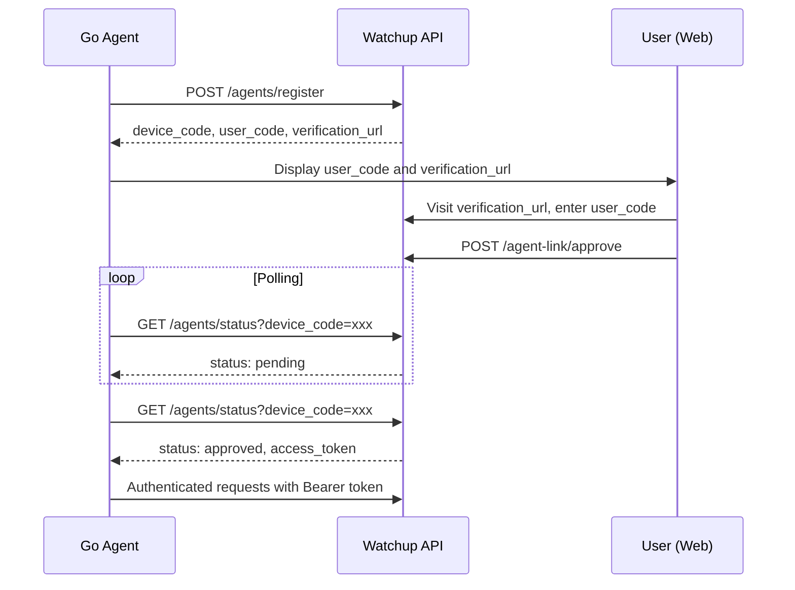

# Agent Authentication API Documentation

## Overview

The Agent Authentication API provides a secure device linking flow for Go agents to authenticate with the Watchup platform. This system uses OAuth2-style device flow where agents register for a device code, users approve the device via web interface, and agents receive access tokens for API authentication.

## Authentication Flow



## Endpoints

### 1. Register Agent Device

**POST** `/agents/register`

Initiates the device linking flow by registering a new agent device.

#### Request Body
```json
{
  "device_name": "Production Server Agent",
  "device_info": {
    "os": "linux",
    "arch": "amd64",
    "version": "1.0.0",
    "hostname": "prod-server-01"
  }
}
```

#### Response (200 OK)
```json
{
  "device_code": "abc123def456...",
  "user_code": "XK92-PQ",
  "verification_url": "https://yourapp.com/agent-link",
  "expires_in": 900,
  "interval": 5
}
```

#### Fields
- `device_code`: Secure code for polling (keep secret)
- `user_code`: Human-readable code for user entry
- `verification_url`: URL where user approves the device
- `expires_in`: Expiration time in seconds (15 minutes)
- `interval`: Recommended polling interval in seconds

---

### 2. Check Device Status

**GET** `/agents/status?device_code={device_code}`

Polls for device approval status. Agents should poll this endpoint until approved or expired.

#### Query Parameters
- `device_code` (required): The device code from registration

#### Response States

**Pending (200 OK)**
```json
{
  "status": "pending"
}
```

**Approved (200 OK)**
```json
{
  "status": "approved",
  "access_token": "eyJ0eXAiOiJKV1QiLCJhbGciOiJIUzI1NiJ9...",
  "token_type": "Bearer"
}
```

**Expired (200 OK)**
```json
{
  "status": "expired"
}
```

**Denied (200 OK)**
```json
{
  "status": "denied"
}
```

#### Error Responses
- `404`: Invalid device code
- `500`: Server error

---

### 3. Validate Agent Token

**GET** `/agents/validate`

Validates an agent token and returns user information.

#### Headers
```
Authorization: Bearer {access_token}
```

#### Response (200 OK)
```json
{
  "valid": true,
  "user": {
    "id": "user-uuid",
    "email": "user@example.com",
    "name": "John Doe"
  }
}
```

#### Error Responses
- `401`: Invalid or expired token
- `500`: Server error

---

### 4. Agent Link Page

**GET** `/agent-link?code={user_code}`

Web page where users approve agent devices. This endpoint returns a JSON response for API clients, but would typically render an HTML page.

#### Query Parameters
- `code` (optional): Pre-filled user code

#### Response (200 OK)
```json
{
  "message": "Agent Device Linking",
  "instructions": "Enter the code shown on your agent device to link it to your account",
  "user_code": "XK92-PQ",
  "form_action": "/agent-link/approve"
}
```

---

### 5. Approve Agent Device

**POST** `/agent-link/approve`

Approves an agent device for linking to user account.

#### Headers
```
Authorization: Bearer {user_jwt_token}
Content-Type: application/json
```

#### Request Body
```json
{
  "user_code": "XK92-PQ"
}
```

#### Response (200 OK)
```json
{
  "message": "Device approved successfully",
  "device_name": "Production Server Agent"
}
```

#### Error Responses
- `401`: Unauthorized (invalid user token)
- `404`: Invalid user code
- `400`: Code expired or already processed

---

### 6. Deny Agent Device

**POST** `/agent-link/deny`

Denies an agent device linking request.

#### Headers
```
Authorization: Bearer {user_jwt_token}
Content-Type: application/json
```

#### Request Body
```json
{
  "user_code": "XK92-PQ"
}
```

#### Response (200 OK)
```json
{
  "message": "Device denied"
}
```

---

### 7. List Agent Tokens

**GET** `/agents/tokens`

Lists all agent tokens for the authenticated user.

#### Headers
```
Authorization: Bearer {user_jwt_token}
```

#### Response (200 OK)
```json
{
  "tokens": [
    {
      "id": "token-uuid",
      "device_name": "Production Server Agent",
      "last_used_at": "2026-04-29T10:30:00Z",
      "is_active": true,
      "created_at": "2026-04-29T09:00:00Z"
    }
  ]
}
```

---

### 8. Revoke Agent Token

**DELETE** `/agents/tokens/{token_id}`

Revokes (deactivates) an agent token.

#### Headers
```
Authorization: Bearer {user_jwt_token}
```

#### Path Parameters
- `token_id`: UUID of the token to revoke

#### Response (200 OK)
```json
{
  "message": "Token revoked successfully"
}
```

#### Error Responses
- `404`: Token not found or not owned by user

## Go Agent Implementation

### 1. Device Registration

```go
type DeviceCodeResponse struct {
    DeviceCode      string `json:"device_code"`
    UserCode        string `json:"user_code"`
    VerificationURL string `json:"verification_url"`
    ExpiresIn       int    `json:"expires_in"`
    Interval        int    `json:"interval"`
}

func RegisterDevice(baseURL, deviceName string, deviceInfo map[string]string) (*DeviceCodeResponse, error) {
    payload := map[string]interface{}{
        "device_name": deviceName,
        "device_info": deviceInfo,
    }
    
    resp, err := http.Post(baseURL+"/agents/register", "application/json", jsonPayload(payload))
    if err != nil {
        return nil, err
    }
    defer resp.Body.Close()
    
    var result DeviceCodeResponse
    err = json.NewDecoder(resp.Body).Decode(&result)
    return &result, err
}
```

### 2. Token Polling

```go
type StatusResponse struct {
    Status      string `json:"status"`
    AccessToken string `json:"access_token,omitempty"`
    TokenType   string `json:"token_type,omitempty"`
}

func PollForToken(baseURL, deviceCode string, interval time.Duration) (string, error) {
    for {
        resp, err := http.Get(fmt.Sprintf("%s/agents/status?device_code=%s", baseURL, deviceCode))
        if err != nil {
            return "", err
        }
        
        var status StatusResponse
        json.NewDecoder(resp.Body).Decode(&status)
        resp.Body.Close()
        
        switch status.Status {
        case "approved":
            return status.AccessToken, nil
        case "denied":
            return "", errors.New("device was denied")
        case "expired":
            return "", errors.New("device code expired")
        case "pending":
            time.Sleep(interval)
            continue
        default:
            return "", fmt.Errorf("unknown status: %s", status.Status)
        }
    }
}
```

### 3. Authenticated Requests

```go
type AuthenticatedClient struct {
    BaseURL    string
    Token      string
    HTTPClient *http.Client
}

func (c *AuthenticatedClient) makeRequest(method, endpoint string, body io.Reader) (*http.Response, error) {
    req, err := http.NewRequest(method, c.BaseURL+endpoint, body)
    if err != nil {
        return nil, err
    }
    
    req.Header.Set("Authorization", "Bearer "+c.Token)
    req.Header.Set("Content-Type", "application/json")
    req.Header.Set("User-Agent", "WatchupGoAgent/1.0.0")
    
    return c.HTTPClient.Do(req)
}

func (c *AuthenticatedClient) ValidateToken() error {
    resp, err := c.makeRequest("GET", "/agents/validate", nil)
    if err != nil {
        return err
    }
    defer resp.Body.Close()
    
    if resp.StatusCode != 200 {
        return errors.New("token validation failed")
    }
    
    return nil
}
```

## Security Considerations

### Token Storage
- Store tokens in files with 0600 permissions (owner read/write only)
- Never log or expose tokens in plain text
- Implement secure token rotation if needed

### Network Security
- Always use HTTPS in production
- Validate SSL certificates
- Implement request timeouts

### Error Handling
- Handle 401 responses by re-authenticating
- Implement exponential backoff for polling
- Log authentication events for monitoring

## Rate Limiting

- Device registration: 10 requests per minute per IP
- Status polling: Follow the `interval` field from registration response
- Token validation: 100 requests per minute per token

## Example Usage

### Complete Flow Example

```bash
# 1. Register device
curl -X POST http://localhost:5000/agents/register \
  -H "Content-Type: application/json" \
  -d '{
    "device_name": "My Server Agent",
    "device_info": {
      "os": "linux",
      "arch": "amd64",
      "version": "1.0.0"
    }
  }'

# Response: {"device_code": "abc123", "user_code": "XK92-PQ", ...}

# 2. User visits verification URL and approves device

# 3. Poll for approval
curl "http://localhost:5000/agents/status?device_code=abc123"

# Response: {"status": "approved", "access_token": "token123", ...}

# 4. Use token for authenticated requests
curl -H "Authorization: Bearer token123" \
  http://localhost:5000/agents/validate
```

## Testing

Use the provided test scripts:

```bash
# Test complete authentication flow
python3 scripts/test_agent_auth.py

# Simulate Go agent flow
python3 scripts/test_go_agent_flow.py

# Test against different server
python3 scripts/test_go_agent_flow.py http://your-server:5000
```

## Troubleshooting

### Common Issues

1. **"Invalid device code"**
   - Device code may have expired (15 minute limit)
   - Check for typos in device code
   - Re-register the device

2. **"Token validation failed"**
   - Token may have been revoked
   - Check token format (should be Bearer token)
   - Verify token hasn't expired

3. **"Database connection failed"**
   - Check database connectivity
   - Verify migration 025 has been applied
   - Check database credentials

### Debug Mode

Enable debug logging in your Go agent:

```go
log.SetLevel(log.DebugLevel)
```

This will show detailed HTTP request/response information for troubleshooting.