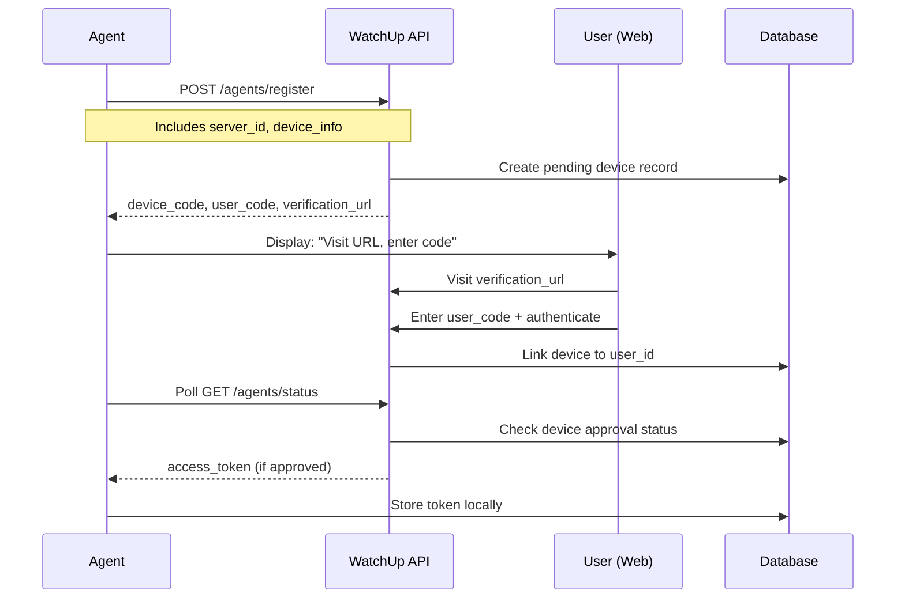

# WatchUp Agent - Open Source Architecture & User Linking

## 🌟 Open Source Strategy

### Making it Open Source Ready

The WatchUp Agent is designed to be **fully open source** while maintaining its core functionality. Here's how it works:

#### **What's Open Source**:
- ✅ **Complete Agent Code** - All monitoring, authentication, and communication logic
- ✅ **Configuration System** - YAML-based configuration management
- ✅ **Metrics Collection** - All system monitoring capabilities
- ✅ **Authentication Flow** - Device linking and token management
- ✅ **Documentation** - Complete setup and usage guides
- ✅ **Build System** - Go modules, cross-platform builds

#### **What Remains Proprietary**:
- 🔒 **Backend API** - The WatchUp platform backend (v2-server.watchup.site)
- 🔒 **Web Dashboard** - The monitoring dashboard and user interface
- 🔒 **Data Processing** - Analytics, alerting, and data aggregation
- 🔒 **User Management** - Account management and billing systems

#### **Benefits of Open Source**:
1. **Transparency** - Users can audit the code for security and functionality
2. **Customization** - Users can modify the agent for specific needs
3. **Community** - Contributors can add new monitoring capabilities
4. **Trust** - Open source builds trust in enterprise environments
5. **Compliance** - Meets open source requirements for many organizations

---

## 🔗 User-Agent Linking System

### How Server Agents are Linked to Users

The WatchUp platform uses a **secure device linking system** that associates each agent with a specific user account:

#### **1. Device Registration Process**



#### **2. Database Schema for User-Agent Linking**

```sql
-- Users table (existing)
CREATE TABLE users (
    id UUID PRIMARY KEY,
    email VARCHAR(255) UNIQUE NOT NULL,
    name VARCHAR(255) NOT NULL,
    created_at TIMESTAMP DEFAULT NOW(),
    plan_type VARCHAR(50) DEFAULT 'free'
);

-- Agent devices table
CREATE TABLE agent_devices (
    id UUID PRIMARY KEY,
    user_id UUID NOT NULL REFERENCES users(id),
    server_id VARCHAR(255) NOT NULL,
    device_name VARCHAR(255) NOT NULL,
    device_code VARCHAR(255) UNIQUE NOT NULL,
    user_code VARCHAR(10) UNIQUE NOT NULL,
    access_token VARCHAR(500) UNIQUE,
    status VARCHAR(20) DEFAULT 'pending', -- pending, approved, denied, expired
    device_info JSONB,
    created_at TIMESTAMP DEFAULT NOW(),
    approved_at TIMESTAMP,
    expires_at TIMESTAMP,
    last_seen_at TIMESTAMP,
    is_active BOOLEAN DEFAULT true,
    
    -- Ensure server_id uniqueness per user
    UNIQUE(user_id, server_id)
);

-- Metrics data table
CREATE TABLE metrics_data (
    id UUID PRIMARY KEY,
    agent_device_id UUID NOT NULL REFERENCES agent_devices(id),
    server_id VARCHAR(255) NOT NULL,
    timestamp TIMESTAMP NOT NULL,
    metrics_data JSONB NOT NULL,
    created_at TIMESTAMP DEFAULT NOW()
);

-- Indexes for performance
CREATE INDEX idx_agent_devices_user_id ON agent_devices(user_id);
CREATE INDEX idx_agent_devices_server_id ON agent_devices(server_id);
CREATE INDEX idx_agent_devices_access_token ON agent_devices(access_token);
CREATE INDEX idx_metrics_data_agent_device_id ON metrics_data(agent_device_id);
CREATE INDEX idx_metrics_data_timestamp ON metrics_data(timestamp);
```

#### **3. Server ID Uniqueness Rules**

The system enforces **server_id uniqueness per user** with the following rules:

##### **Per-User Uniqueness**:
```sql
-- Each user can have only ONE agent with a specific server_id
UNIQUE(user_id, server_id)
```

##### **Cross-User Allowance**:
- ✅ **User A** can have `server_id: "web-prod-01"`
- ✅ **User B** can also have `server_id: "web-prod-01"`
- ❌ **User A** cannot have two agents with `server_id: "web-prod-01"`

##### **Validation Logic**:
```javascript
// Backend validation during agent registration
async function validateServerRegistration(userId, serverId) {
    const existingAgent = await db.query(`
        SELECT id FROM agent_devices 
        WHERE user_id = $1 AND server_id = $2 AND is_active = true
    `, [userId, serverId]);
    
    if (existingAgent.length > 0) {
        throw new Error(`Server ID '${serverId}' already exists for this user`);
    }
}
```

#### **4. Agent Registration API Enhancement**

```javascript
// POST /agents/register
app.post('/agents/register', async (req, res) => {
    const { device_name, device_info } = req.body;
    const server_id = device_info.server_id;
    
    // Validate server_id format
    if (!server_id || server_id.length < 3) {
        return res.status(400).json({
            error: 'server_id must be at least 3 characters'
        });
    }
    
    // Generate codes
    const device_code = generateSecureCode(32);
    const user_code = generateUserCode(6); // e.g., "XK92-PQ"
    
    // Store pending device
    await db.query(`
        INSERT INTO agent_devices (
            device_code, user_code, server_id, device_name, 
            device_info, expires_at, status
        ) VALUES ($1, $2, $3, $4, $5, $6, 'pending')
    `, [
        device_code, user_code, server_id, device_name,
        JSON.stringify(device_info),
        new Date(Date.now() + 15 * 60 * 1000) // 15 minutes
    ]);
    
    res.json({
        device_code,
        user_code,
        verification_url: `${process.env.FRONTEND_URL}/agent-link`,
        expires_in: 900, // 15 minutes
        interval: 5
    });
});
```

#### **5. Device Approval Process**

```javascript
// POST /agent-link/approve
app.post('/agent-link/approve', authenticateUser, async (req, res) => {
    const { user_code } = req.body;
    const user_id = req.user.id;
    
    // Find pending device
    const device = await db.query(`
        SELECT * FROM agent_devices 
        WHERE user_code = $1 AND status = 'pending' AND expires_at > NOW()
    `, [user_code]);
    
    if (!device.length) {
        return res.status(404).json({ error: 'Invalid or expired code' });
    }
    
    const deviceRecord = device[0];
    
    // Check for server_id conflicts
    const existingAgent = await db.query(`
        SELECT id FROM agent_devices 
        WHERE user_id = $1 AND server_id = $2 AND is_active = true
    `, [user_id, deviceRecord.server_id]);
    
    if (existingAgent.length > 0) {
        return res.status(409).json({
            error: `You already have an agent with server_id '${deviceRecord.server_id}'`,
            suggestion: 'Use a different server_id or deactivate the existing agent'
        });
    }
    
    // Generate access token
    const access_token = jwt.sign(
        { 
            device_id: deviceRecord.id,
            user_id: user_id,
            server_id: deviceRecord.server_id
        },
        process.env.JWT_SECRET,
        { expiresIn: '1y' }
    );
    
    // Approve device
    await db.query(`
        UPDATE agent_devices 
        SET user_id = $1, access_token = $2, status = 'approved', approved_at = NOW()
        WHERE id = $3
    `, [user_id, access_token, deviceRecord.id]);
    
    res.json({
        message: 'Device approved successfully',
        device_name: deviceRecord.device_name,
        server_id: deviceRecord.server_id
    });
});
```

#### **6. Metrics Submission with Ownership**

```javascript
// POST /metrics
app.post('/metrics', authenticateAgent, async (req, res) => {
    const { server_id, timestamp, metrics } = req.body;
    const { device_id, user_id } = req.agent; // From JWT token
    
    // Verify server_id matches the registered agent
    if (req.agent.server_id !== server_id) {
        return res.status(403).json({
            error: 'server_id mismatch',
            expected: req.agent.server_id,
            received: server_id
        });
    }
    
    // Store metrics with ownership
    await db.query(`
        INSERT INTO metrics_data (agent_device_id, server_id, timestamp, metrics_data)
        VALUES ($1, $2, $3, $4)
    `, [device_id, server_id, new Date(timestamp * 1000), JSON.stringify(metrics)]);
    
    // Update last seen
    await db.query(`
        UPDATE agent_devices 
        SET last_seen_at = NOW() 
        WHERE id = $1
    `, [device_id]);
    
    res.json({ status: 'success', message: 'Metrics received' });
});
```

---

## 🔐 Security & Ownership Model

### **1. Token-Based Ownership**
Each agent token contains:
```json
{
  "device_id": "uuid-of-agent-device",
  "user_id": "uuid-of-owner",
  "server_id": "web-prod-01",
  "iat": 1714392000,
  "exp": 1745928000
}
```

### **2. Access Control**
- **Agents** can only submit metrics for their registered `server_id`
- **Users** can only view metrics from their own agents
- **API calls** are validated against token ownership

### **3. Multi-Tenancy**
```javascript
// Get user's agents
app.get('/api/agents', authenticateUser, async (req, res) => {
    const agents = await db.query(`
        SELECT server_id, device_name, last_seen_at, is_active, created_at
        FROM agent_devices 
        WHERE user_id = $1 AND is_active = true
        ORDER BY created_at DESC
    `, [req.user.id]);
    
    res.json({ agents });
});

// Get metrics for user's specific agent
app.get('/api/metrics/:server_id', authenticateUser, async (req, res) => {
    const { server_id } = req.params;
    const user_id = req.user.id;
    
    // Verify ownership
    const agent = await db.query(`
        SELECT id FROM agent_devices 
        WHERE user_id = $1 AND server_id = $2 AND is_active = true
    `, [user_id, server_id]);
    
    if (!agent.length) {
        return res.status(404).json({ error: 'Agent not found' });
    }
    
    // Get metrics
    const metrics = await db.query(`
        SELECT timestamp, metrics_data 
        FROM metrics_data 
        WHERE agent_device_id = $1 
        ORDER BY timestamp DESC 
        LIMIT 100
    `, [agent[0].id]);
    
    res.json({ metrics });
});
```

---

## 🏢 Enterprise Features

### **1. Team Management**
```sql
-- Teams table for enterprise users
CREATE TABLE teams (
    id UUID PRIMARY KEY,
    name VARCHAR(255) NOT NULL,
    owner_id UUID NOT NULL REFERENCES users(id),
    created_at TIMESTAMP DEFAULT NOW()
);

-- Team members
CREATE TABLE team_members (
    team_id UUID REFERENCES teams(id),
    user_id UUID REFERENCES users(id),
    role VARCHAR(50) DEFAULT 'member', -- owner, admin, member, viewer
    PRIMARY KEY (team_id, user_id)
);

-- Allow team access to agents
ALTER TABLE agent_devices ADD COLUMN team_id UUID REFERENCES teams(id);
```

### **2. Agent Management Dashboard**
Users can manage their agents through the web interface:

- **View All Agents**: List of registered agents with status
- **Agent Details**: Detailed metrics and configuration
- **Deactivate Agents**: Remove agents that are no longer needed
- **Regenerate Tokens**: Security feature for compromised tokens
- **Agent Logs**: View connection and error logs

### **3. Billing Integration**
```javascript
// Check agent limits based on user plan
async function checkAgentLimits(userId) {
    const user = await db.query(`
        SELECT plan_type FROM users WHERE id = $1
    `, [userId]);
    
    const activeAgents = await db.query(`
        SELECT COUNT(*) as count FROM agent_devices 
        WHERE user_id = $1 AND is_active = true
    `, [userId]);
    
    const limits = {
        free: 3,
        pro: 25,
        enterprise: 1000
    };
    
    const limit = limits[user[0].plan_type] || limits.free;
    
    if (activeAgents[0].count >= limit) {
        throw new Error(`Agent limit reached (${limit} agents for ${user[0].plan_type} plan)`);
    }
}
```

---

## 🔄 Agent Lifecycle Management

### **1. Agent States**
```javascript
const AGENT_STATES = {
    PENDING: 'pending',     // Waiting for user approval
    APPROVED: 'approved',   // Active and sending metrics
    DENIED: 'denied',       // User rejected the device
    EXPIRED: 'expired',     // Registration expired
    INACTIVE: 'inactive',   // Manually deactivated
    REVOKED: 'revoked'      // Token revoked for security
};
```

### **2. Automatic Cleanup**
```javascript
// Clean up expired registrations (run periodically)
async function cleanupExpiredRegistrations() {
    await db.query(`
        UPDATE agent_devices 
        SET status = 'expired' 
        WHERE status = 'pending' AND expires_at < NOW()
    `);
}

// Mark agents as offline if no metrics received
async function markOfflineAgents() {
    await db.query(`
        UPDATE agent_devices 
        SET is_active = false 
        WHERE last_seen_at < NOW() - INTERVAL '1 hour' 
        AND is_active = true
    `);
}
```

### **3. Agent Replacement**
When a user wants to replace an agent with the same `server_id`:

```javascript
// Deactivate existing agent and register new one
app.post('/agents/replace', authenticateUser, async (req, res) => {
    const { server_id } = req.body;
    const user_id = req.user.id;
    
    // Deactivate existing agent
    await db.query(`
        UPDATE agent_devices 
        SET is_active = false, status = 'replaced'
        WHERE user_id = $1 AND server_id = $2 AND is_active = true
    `, [user_id, server_id]);
    
    res.json({ message: 'Existing agent deactivated. You can now register a new agent with the same server_id.' });
});
```

---

## 📊 Open Source Benefits

### **For Users**:
1. **Security Audit** - Can review all agent code
2. **Custom Modifications** - Add custom metrics or integrations
3. **Self-Hosting** - Can run against custom backends
4. **Compliance** - Meets enterprise open source requirements

### **For WatchUp**:
1. **Community Growth** - Contributors add features
2. **Trust Building** - Transparency builds user confidence
3. **Market Expansion** - Reaches open source-first organizations
4. **Quality Improvement** - Community finds and fixes bugs

### **License Recommendation**:
- **Agent Code**: MIT License (permissive, business-friendly)
- **Documentation**: Creative Commons
- **Backend API**: Proprietary (maintains business model)

---

## 🎯 Summary

The WatchUp Agent achieves the perfect balance:

✅ **Fully Open Source Agent** - Complete transparency and customization
✅ **Secure User Linking** - Each agent is tied to a specific user account
✅ **Server ID Uniqueness** - Per-user uniqueness prevents conflicts
✅ **Enterprise Ready** - Team management, billing integration, lifecycle management
✅ **Scalable Architecture** - Supports thousands of users and agents
✅ **Business Model Protection** - Backend and dashboard remain proprietary

This architecture ensures users get the benefits of open source while WatchUp maintains its competitive advantage and revenue model.